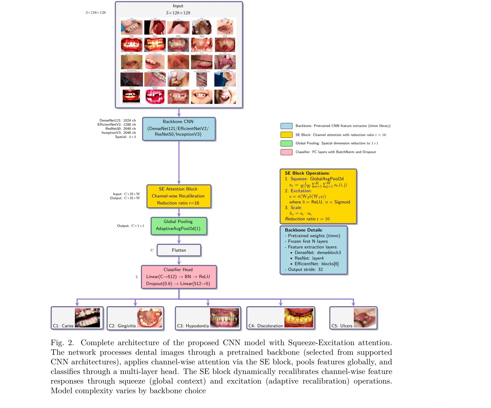
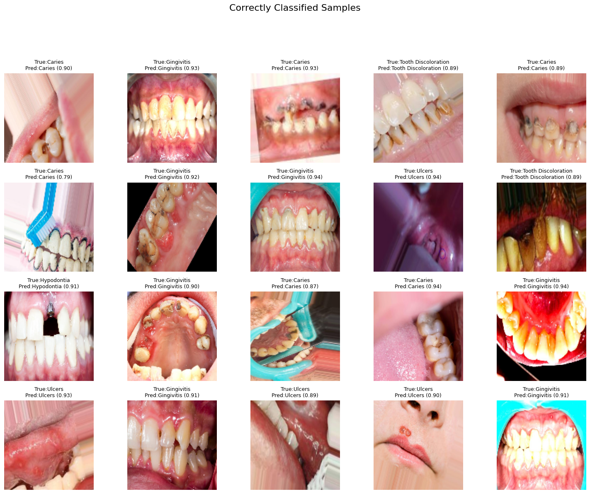
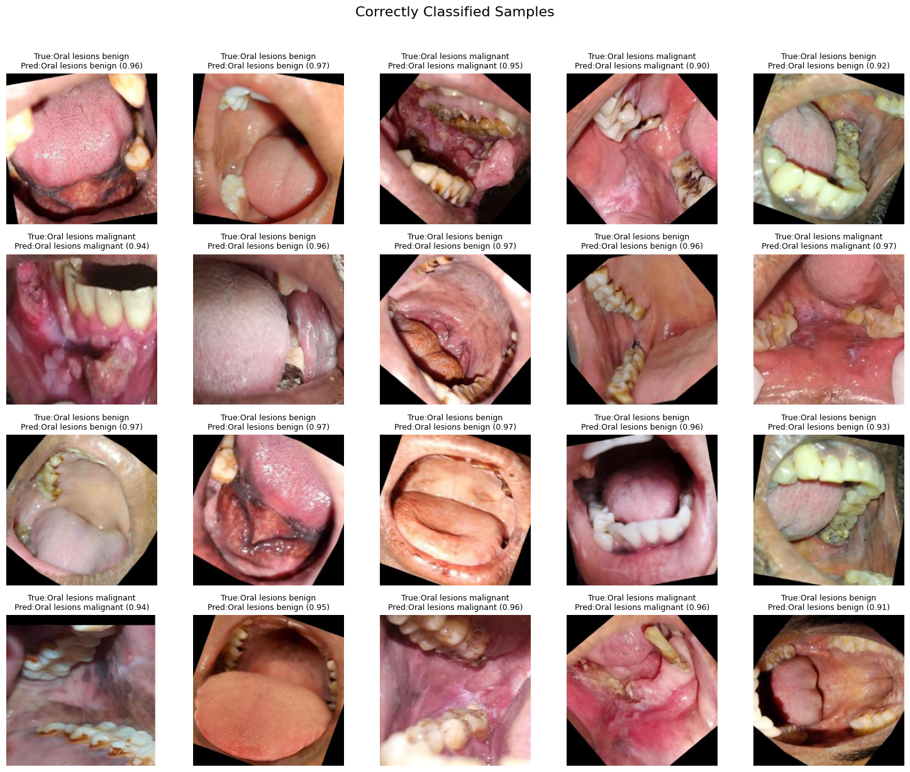
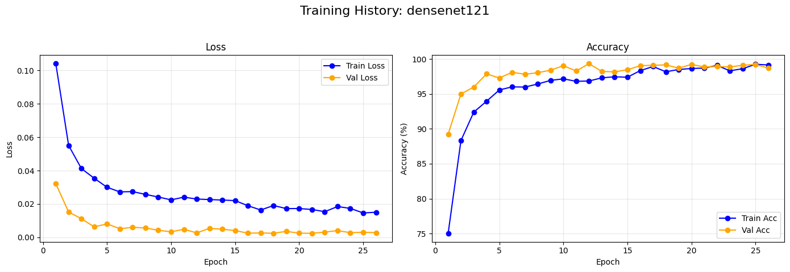
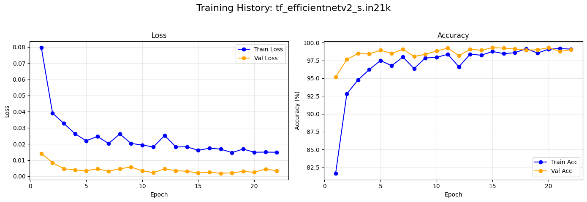
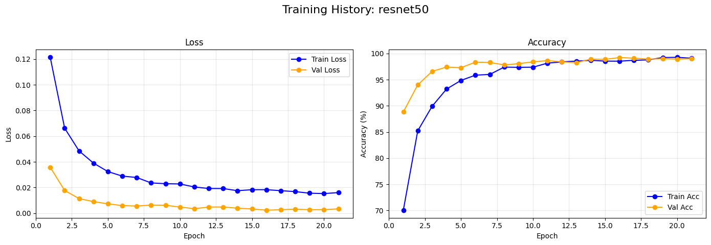
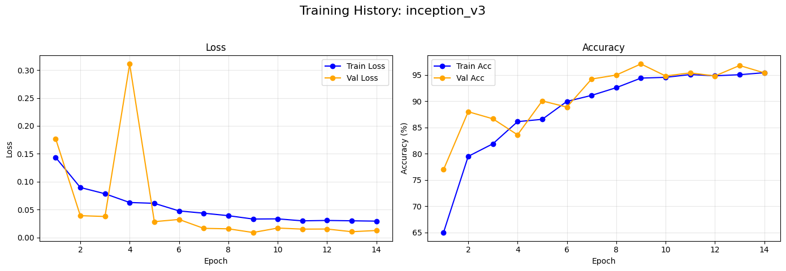
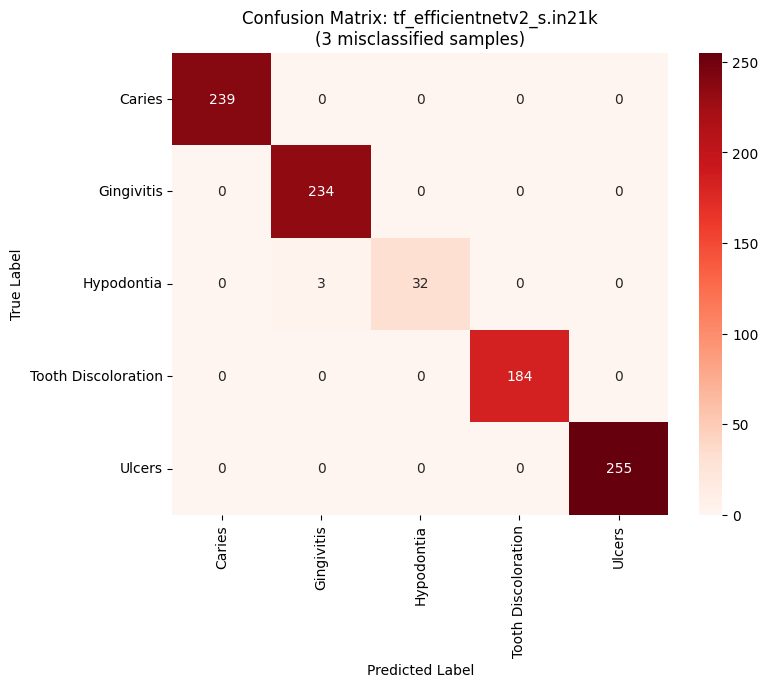
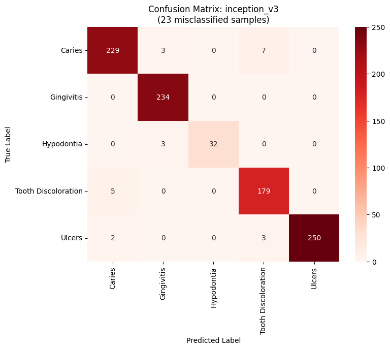

# DentFuseNet: Dynamically WeightedInterpretable Ensembles for Multi-Condition Dental and Oral Cancer Diagnostics

Abstract

Although deep learning is increasingly used in medical imaging, current dental and oral diagnostic systems often face challenges such as limited adaptability, task-specific fragmentation, and a lack of transparency—factors that hinder their reliability and acceptance in clinical settings. Most existing models focus separately on either dental diseases or oral cancer, leading to fragmented solutions. Additionally, single-model approaches often struggle with imbalanced data and produce inconsistent errors, limiting their effectiveness.To tackle these issues, we introduce DentFuseNet , a cohesive, explainable, and adaptively weighted ensemble framework that combines four well-known convolutional neural network (CNN) architectures: DenseNet121, EfficientNetV2, ResNet50, and InceptionV3. The proposed system is designed to perform dual tasks: (1) identifying five common dental conditions Caries, Gingivitis, Hypodontia, Tooth Discoloration, and Ulcers and (2) distinguishing between benign and malignant oral lesions.DentFuseNet leverages a model-weighting strategy based on validation performance, allowing each CNN to contribute optimally to the final prediction, thus improving overall stability and accuracy. Comprehensive evaluations on two publicly accessible clinical image datasets show that DentFuseNet achieves exceptional results without any fine-tuning: 99.68% accuracy and a Matthews Correlation Coefficient (MCC) of 1.00 for multi-class dental disease classification, and 98.53% accuracy with an MCC of 0.97 for oral cancer detection. Importantly, the model also demonstrates a very low false-negative rate of 2.4% for malignant cases.To enhance interpretability and foster clinical trust, the framework incorporates Grad-CAM and t-SNE visualization techniques, offering transparent insights into its decision-making process. These visual tools align well with clinical expectations and support explainable AI in oral diagnostics. Our findings underscore the advantages of ensemble learning over single-model approaches and illustrate the potential of integrated AI systems in multi-disease oral health screening. This work establishes a new standard in performance and provides a scalable blueprint for developing AI tools suitable for real-world clinical deployment. Future studies will focus on external validation and incorporating multi-modal data to further improve model generalizability across diverse healthcare environments.

Figure 1: Correct Classification

Figure 2: Correct Classification

Figure 3: Learning curve of DenseNet121

Figure 4: Learning curve of EfficientNetV2

Figure 5: Learning curve of ResNet50

Figure 6: Learning curve of InceptionV3

Figure 7: Confusion matrix of DenseNet121

Figure 8: Confusion matrix of EfficientNetV2

Figure 9: Confusion matrix of ResNet50

Figure 10: Confusion matrix of InceptionV3

Figure 11: Confusion matrix of weighted ensemble

### Test set performance with TTA (Dental)

| Model               | Test Loss | Acc (%) | Bal Acc (%) | Prec (%) | Recall (%) | F1 (%) | Spec (%) | Kappa | MCC  | Log Loss | Brier | AUC  |
|---------------------|-----------|---------|-------------|----------|------------|--------|----------|-------|------|----------|-------|------|
| Densenet121         | 0.00      | 97.36   | 97.32       | 97.44    | 97.36      | 97.36  | 97.32    | 0.95  | 0.95 | 0.09     | 0.02  | 1.00 |
| EfficientNetV2      | 0.00      | 98.83   | 98.81       | 98.83    | 98.83      | 98.83  | 98.81    | 0.98  | 0.98 | 0.06     | 0.01  | 1.00 |
| Resnet50            | 0.00      | 98.53   | 98.52       | 98.55    | 98.53      | 98.53  | 98.52    | 0.97  | 0.97 | 0.08     | 0.01  | 1.00 |
| inceptionv3         | 0.00      | 98.53   | 98.50       | 98.57    | 98.53      | 98.53  | 98.50    | 0.97  | 0.97 | 0.08     | 0.02  | 1.00 |
| **Weighted Ensemble** | 0.00      | 98.53   | 98.52       | 98.55    | 98.53      | 98.53  | 98.52    | 0.97  | 0.97 | 0.07     | 0.01  | 1.00 |

### Test set performance with TTA (Oral cancer)

| Model               | Test Loss | Acc (%) | Bal Acc (%) | Prec (%) | Recall (%) | F1 (%) | Spec (%) | Kappa | MCC  | Log Loss | Brier | AUC  |
|---------------------|-----------|---------|-------------|----------|------------|--------|----------|-------|------|----------|-------|------|
| Densenet121         | 0.00      | 97.36   | 97.32       | 97.44    | 97.36      | 97.36  | 97.32    | 0.95  | 0.95 | 0.09     | 0.02  | 1.00 |
| EfficientNetV2      | 0.00      | 98.83   | 98.81       | 98.83    | 98.83      | 98.83  | 98.81    | 0.98  | 0.98 | 0.06     | 0.01  | 1.00 |
| Resnet50            | 0.00      | 98.53   | 98.52       | 98.55    | 98.53      | 98.53  | 98.52    | 0.97  | 0.97 | 0.08     | 0.01  | 1.00 |
| inceptionv3         | 0.00      | 98.53   | 98.50       | 98.57    | 98.53      | 98.53  | 98.50    | 0.97  | 0.97 | 0.08     | 0.02  | 1.00 |
| **Weighted Ensemble** | 0.00      | 98.53   | 98.52       | 98.55    | 98.53      | 98.53  | 98.52    | 0.97  | 0.97 | 0.07     | 0.01  | 1.00 |

